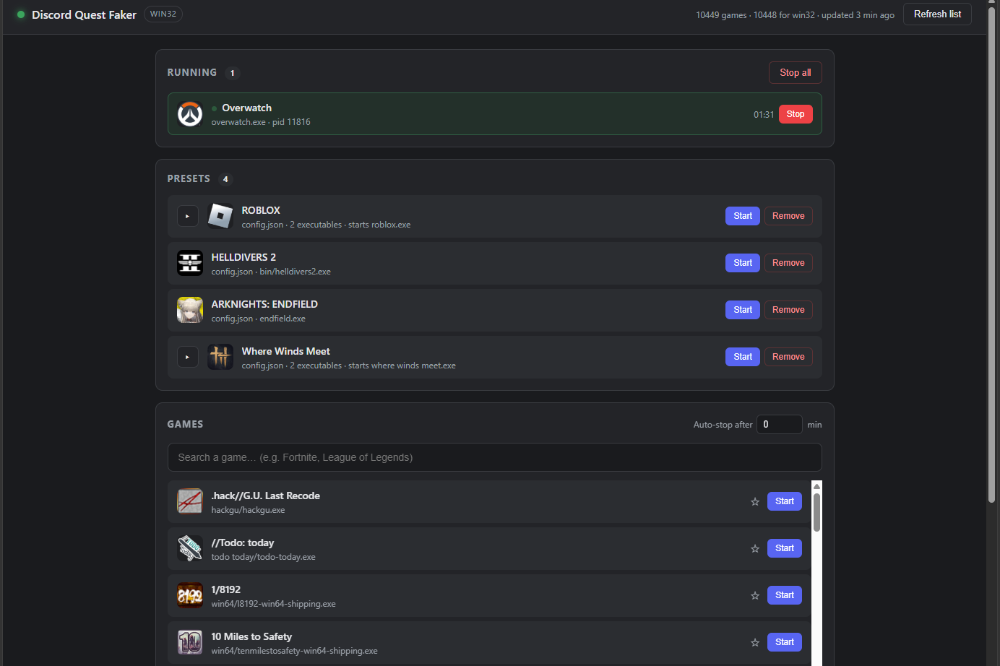

# Discord Quest Faker

**ภาษาไทย** · [English](README.en.md)

[](LICENSE)
[](https://nodejs.org)
[](https://github.com/RavMonK/discord-quest-faker/wiki/TH-Platform-Notes)
[](package.json)
[](https://github.com/RavMonK/discord-quest-faker/wiki)

โปรแกรมเล็ก ๆ ที่ดึง **รายชื่อเกมที่ Discord ตรวจจับได้** (~10,400 เกม) มาเก็บเป็นไฟล์ JSON
แล้วสร้าง "โปรเซสเกมปลอม" ที่มีชื่อและ path ตรงตามนั้น ให้ Discord มองว่ากำลังเล่นเกมนั้นอยู่
เพื่อให้ quest ประเภท *"เล่นเกม X เป็นเวลา Y นาที"* เดินหน้าไปได้ — ควบคุมผ่านหน้าเว็บบนเครื่องตัวเอง

Node.js ล้วน ๆ **ไม่มี dependency ภายนอกแม้แต่ตัวเดียว** ไม่ต้อง `npm install`

<p align="center">
  
</p>

---

## ⚠️ คำเตือนก่อนใช้งาน / Disclaimer

- โปรแกรมนี้ทำให้ Discord **แสดงสถานะที่ไม่ตรงกับความจริง** ซึ่ง**ขัดกับ Terms of Service ของ Discord**
- อาจทำให้ **quest ถูกยกเลิก รางวัลถูกเรียกคืน หรือบัญชีถูกจำกัด/ระงับ** — ความเสี่ยงเป็นของผู้ใช้เอง
- เผยแพร่เพื่อ**การศึกษาและใช้ส่วนตัว**เท่านั้น ไม่มีการรับประกันใด ๆ ([LICENSE](LICENSE))
- **ไม่มีส่วนเกี่ยวข้อง**กับ Discord, Valve/Steam, SteamDB หรือผู้พัฒนาเกมใด ๆ
  และไม่แตะ token / รหัสผ่าน / ข้อมูลบัญชีใด ๆ ทั้งสิ้น
- **ถ้าไม่รับความเสี่ยงข้างต้น อย่าใช้**

> **English** — This tool makes Discord report a game you are not playing, which violates
> Discord's Terms of Service and may get quests voided, rewards revoked, or your account limited.
> Educational and personal use only, no warranty, not affiliated with Discord or any publisher,
> and no account credentials are ever read or transmitted. Use at your own risk.

อ่านฉบับเต็ม: [ไทย](https://github.com/RavMonK/discord-quest-faker/wiki/TH-Disclaimer) ·
[English](https://github.com/RavMonK/discord-quest-faker/wiki/EN-Disclaimer)

---

## เริ่มใช้

ต้องมี **Node.js 22/24/26 (แนะนำ 24 LTS)** และเปิด **Discord ตัว desktop** ไว้ (เวอร์ชันเว็บตรวจจับเกมไม่ได้)

```bash
node src/index.js          # Windows ดับเบิลคลิก start.bat ก็ได้
./start.sh                 # macOS / Linux
```

หน้าเว็บควบคุมจะเปิดที่ <http://127.0.0.1:5011> → ค้นชื่อเกม → กด **Start** →
มีหน้าต่างเล็ก ๆ ชื่อเกมเด้งขึ้นมา (นั่นคือโปรเซสปลอม **อย่าปิด** — ปิดเท่ากับกด Stop)

ยังต้องเปิดสองสวิตช์ในตัว Discord ด้วย ไม่งั้นรันเปล่า:
**Activity Privacy → Share your detected activities** และ
**Registered Games → Display currently running game**
([ขั้นตอนละเอียด](https://github.com/RavMonK/discord-quest-faker/wiki/TH-Getting-Started))

---

## 📖 เอกสาร (Wiki — ไทย / English)

ทุกอย่างอยู่ใน [Wiki](https://github.com/RavMonK/discord-quest-faker/wiki) สองภาษา
(ต้นทางอยู่ที่โฟลเดอร์ [`wiki/`](wiki/) ใน repo นี้)

| หัวข้อ | ไทย | English |
|---|---|---|
| ภาพรวมโปรเจกต์ | [TH](https://github.com/RavMonK/discord-quest-faker/wiki/TH-Overview) | [EN](https://github.com/RavMonK/discord-quest-faker/wiki/EN-Overview) |
| เริ่มต้นใช้งาน | [TH](https://github.com/RavMonK/discord-quest-faker/wiki/TH-Getting-Started) | [EN](https://github.com/RavMonK/discord-quest-faker/wiki/EN-Getting-Started) |
| หลักการทำงาน (ทำไมต้องมีหน้าต่างจริง) | [TH](https://github.com/RavMonK/discord-quest-faker/wiki/TH-How-It-Works) | [EN](https://github.com/RavMonK/discord-quest-faker/wiki/EN-How-It-Works) |
| หน้าเว็บควบคุม | [TH](https://github.com/RavMonK/discord-quest-faker/wiki/TH-Control-Panel) | [EN](https://github.com/RavMonK/discord-quest-faker/wiki/EN-Control-Panel) |
| คำสั่ง command line | [TH](https://github.com/RavMonK/discord-quest-faker/wiki/TH-CLI-Reference) | [EN](https://github.com/RavMonK/discord-quest-faker/wiki/EN-CLI-Reference) |
| การตั้งค่า `config.json` | [TH](https://github.com/RavMonK/discord-quest-faker/wiki/TH-Configuration) | [EN](https://github.com/RavMonK/discord-quest-faker/wiki/EN-Configuration) |
| เพิ่มเกมจาก Steam | [TH](https://github.com/RavMonK/discord-quest-faker/wiki/TH-Steam-Games) | [EN](https://github.com/RavMonK/discord-quest-faker/wiki/EN-Steam-Games) |
| ความต่างของแต่ละระบบ | [TH](https://github.com/RavMonK/discord-quest-faker/wiki/TH-Platform-Notes) | [EN](https://github.com/RavMonK/discord-quest-faker/wiki/EN-Platform-Notes) |
| แก้ปัญหา & FAQ | [TH](https://github.com/RavMonK/discord-quest-faker/wiki/TH-Troubleshooting) | [EN](https://github.com/RavMonK/discord-quest-faker/wiki/EN-Troubleshooting) |
| สถาปัตยกรรมโค้ด | [TH](https://github.com/RavMonK/discord-quest-faker/wiki/TH-Architecture) | [EN](https://github.com/RavMonK/discord-quest-faker/wiki/EN-Architecture) |
| HTTP API | [TH](https://github.com/RavMonK/discord-quest-faker/wiki/TH-HTTP-API) | [EN](https://github.com/RavMonK/discord-quest-faker/wiki/EN-HTTP-API) |
| การพัฒนาและทดสอบ | [TH](https://github.com/RavMonK/discord-quest-faker/wiki/TH-Development) | [EN](https://github.com/RavMonK/discord-quest-faker/wiki/EN-Development) |

**Discord ไม่ขึ้นว่ากำลังเล่นเกม?** ไปที่
[แก้ปัญหา](https://github.com/RavMonK/discord-quest-faker/wiki/TH-Troubleshooting) ก่อน

---

## License

[MIT](LICENSE) © 2026 RavMonK

แนวคิดการทำ placeholder ที่มีหน้าต่างจริง อ้างอิงจาก
[markterence/discord-quest-completer](https://github.com/markterence/discord-quest-completer)
